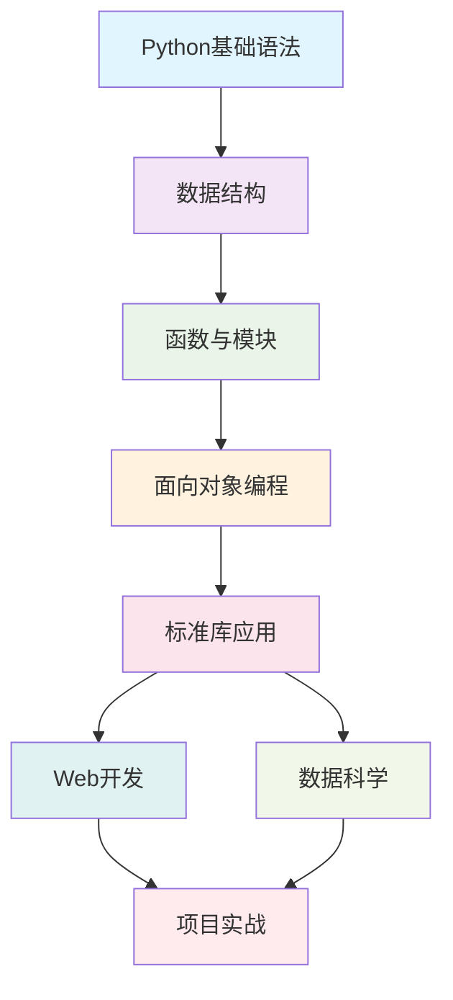

# 关于本书

## 📝 写作初衷

在Python学习的过程中，很多人会遇到这样的困惑：

- 🤔 **知识点零散**：网上的教程质量参差不齐，缺乏系统性
- 🤔 **理论与实践脱节**：很多教程只讲语法，不讲实际应用
- 🤔 **学习路径不清晰**：不知道从何开始，如何进阶
- 🤔 **版本更新快**：很多资料还停留在旧版本时代

《Python 100问》就是为了解决这些问题而诞生的。

## 🎯 目标读者

本书适合以下读者：

### 🔰 Python初学者
- 编程零基础，想要学习Python
- 有其他语言基础，想要快速上手Python
- 自学能力强，喜欢通过问题驱动学习

### 💼 在职开发者
- 想要系统梳理Python知识体系
- 需要快速查阅Python特定问题的解决方案
- 希望了解Python在不同领域的应用

### 🎓 学生群体
- 计算机相关专业学生
- 准备技术面试的求职者
- 对数据科学和AI感兴趣的学习者

## 📖 内容特色

### 🎯 问题驱动学习法
每个知识点都以问题的形式呈现，符合人类的认知习惯：
- **问题提出** → **分析思路** → **代码实现** → **知识扩展**

### 💻 代码优先原则
- 所有示例代码都经过测试，可以直接运行
- 提供多种解决方案，展示不同的编程思路
- 代码注释详细，便于理解

### 📚 官方文档标准
- 基于[Python官方文档](https://www.python.org/doc/)编写
- 确保内容的准确性和权威性
- 与Python官方教程保持一致

### 🌐 全栈技能覆盖
包含Python在各个领域的应用：
- 基础编程和算法
- Web开发 (Flask, Django)
- 数据科学 (NumPy, Pandas, Matplotlib)
- 机器学习入门

## 🛠️ 技术栈

本书基于以下技术栈编写：

### Python版本
- **Python 3.8+**：主要基于Python 3.8及以上版本
- 向前兼容Python 3.6, 3.7
- 标注了版本特性差异

### 主要框架与库
=== "Web开发"
    - Flask 2.x
    - Django 4.x  
    - FastAPI 0.100+
    - SQLAlchemy 2.x

=== "数据科学"
    - NumPy 1.20+
    - Pandas 1.3+
    - Matplotlib 3.5+
    - Scikit-learn 1.0+

=== "其他工具"
    - Requests 2.28+
    - PyTest 7.x
    - Black (代码格式化)
    - Flake8 (代码检查)

## 📊 学习路径图

## 👨‍💻 作者介绍

**夏光**，资深Python开发者，拥有多年的Web开发和数据科学项目经验。

### 技术背景
- 🏢 曾就职于多家互联网公司
- 💼 参与过大型Web项目的架构设计
- 📊 在数据分析和机器学习领域有丰富实践经验
- 📝 技术博客累计阅读量超过100万

### 开源贡献
- 🌟 GitHub上维护多个Python开源项目
- 📚 为多个知名Python库贡献过代码
- 🎯 活跃在Python技术社区

## 📄 版权声明

本书采用 **Creative Commons Attribution-NonCommercial-ShareAlike 4.0 International License** 许可协议。

这意味着您可以：
- ✅ **分享**：以任何媒介或格式复制、发行本作品
- ✅ **演绎**：修改、转换或以本作品为基础进行创作

但需要遵循以下条件：
- 📝 **署名**：必须给出适当的署名
- 🚫 **非商业性使用**：不得将本作品用于商业目的  
- 🔄 **相同方式共享**：如果修改本作品，必须采用相同许可协议

## 🤝 参与贡献

我们欢迎读者参与本书的完善：

### 如何贡献
1. **报告错误**：发现内容错误或代码bug
2. **提出建议**：改进建议或新增内容想法
3. **翻译校对**：帮助改进文字表达
4. **代码优化**：提供更好的代码实现

### 联系方式
- 📧 **Email**: xiaguang@example.com
- 🐙 **GitHub**: https://github.com/xiaguang/python100
- 💬 **微信群**: 扫描二维码加入学习群

## 📈 版本历史

| 版本 | 日期 | 更新内容 |
|------|------|----------|
| v1.0 | 2024-01 | 初始版本，包含100个核心问题 |
| v1.1 | 2024-02 | 增加实战项目示例 |
| v1.2 | 2024-03 | 更新Python 3.12新特性 |

!!! note "致谢"
    感谢所有为本书提供建议和帮助的朋友们，以及Python开源社区的贡献者们。特别感谢Python软件基金会提供的优秀文档资源。

---

**让我们一起在Python的世界里探索无限可能！** 🚀